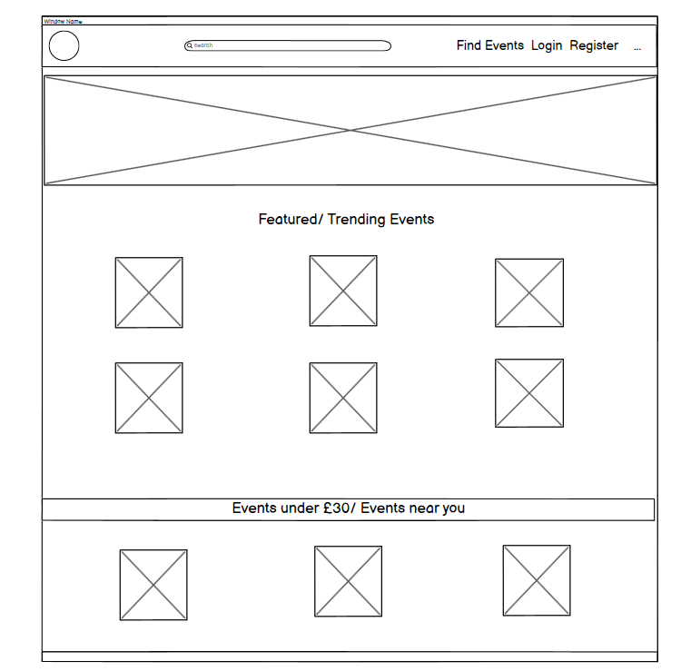
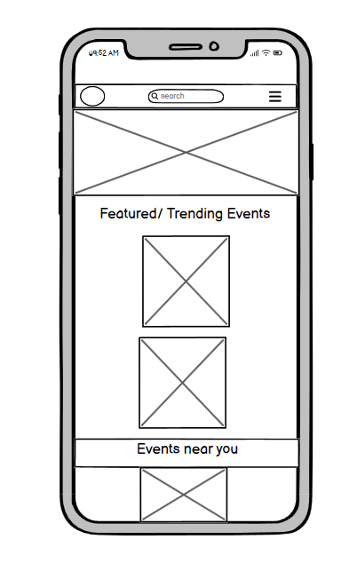
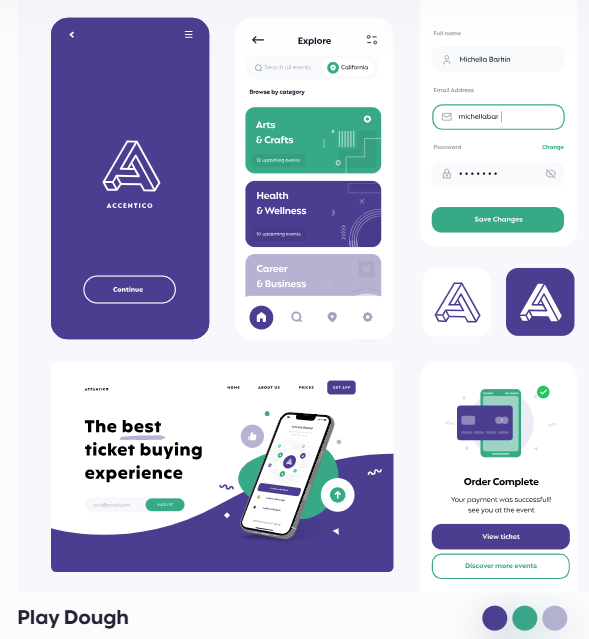
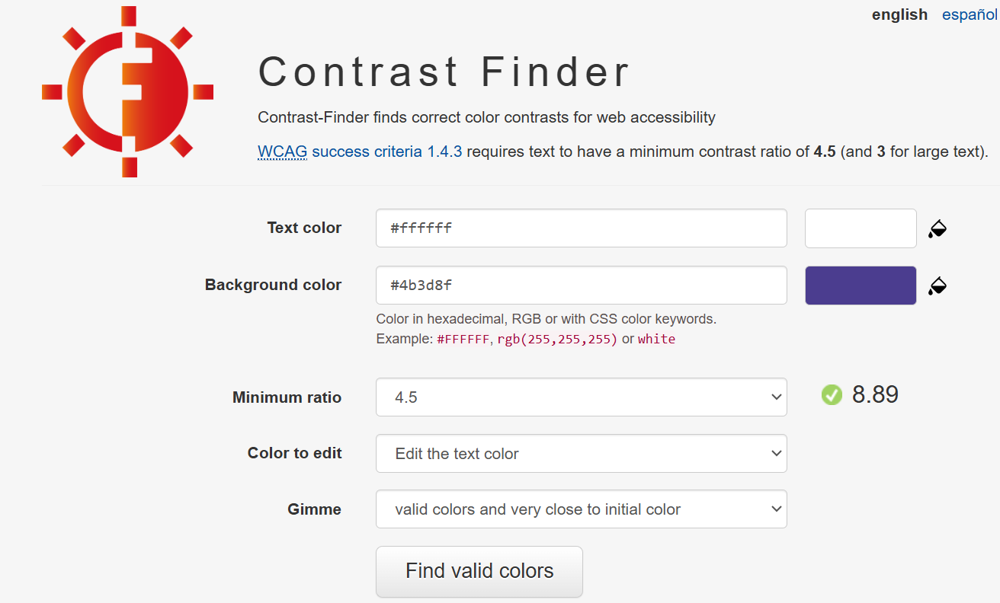

# Where2
For this Hackathon, the aim was to develop an Event finder website using the Django web framework. Inspired by traditional event finders like TicketMaster and Eventbrite, this application includes CRUD functionality,  the option to search for events.... 

The website was built using Django, HTML, CSS, and JavaScript, computer/laptop-based first, rather than mobile, however we have ensured wide accessibility & responsiveness across various devices and platforms.

Created by James, Dougie, Ronan and Maja. 

This project can be found at: 

## Table of Contents
- [User experience (UX)](#user-experience-ux)
   * [Objectives](#objectives)
   * [User stories](#user-stories)
- [Agile Practice/ Development](#AgilePractice/Development)
- [Design](#Design)
* [Color Palette](#ColorPalette)
* [Icons & Images](#Icons&Images)
- [Features](#Features)
- [Deployment](#Deployment)
- [Validation](#Validation)
- [Issues & Bugs](#Issues&Bugs)
- [Future Features](#FutureFeatures)
- [Acknowledgements](#Acknowledgements)

## User Experience (UX)

### Objectives
The objective of this hackathon project was to:

* Develop a user-friendly interface using an intuitive and responsive web application that allows users to easily search for and view events based on criteria such as location, date, category, or keywords.

* Implement robust backend functionality using Python web framework (e.g., Django) to design a secure and scalable backend that handles user authentication, event data storage, and efficient querying.

* Integrate external APIs to fetch real-time event information and display it dynamically on the platform.

* Allow users to create accounts amd save favorite events.

* Optimize the application for both desktop and mobile devices by implementing responsive design principles and testing across various browsers.

These objectives were created using Perplexity.ai. 

### User stories 
User Stories for this project were generated by [DeepSeek.ai](), in line with the requirements and attributes of the aims of the event finder. 

* As an Event Organizer/ Admin, I want to edit or update event details so that I can make changes if needed.
* As an Event Organizer/ Admin, I want to cancel/ 'delete' an event so that users are informed if it’s no longer happening.
* As an Event Organizer/ Admin, I want to add, edit, or remove event categories so that the platform stays organized.
* As an Event Organizer, I want to add event details (e.g., title, description, date, time, location, category, and ticket information) so that users have all the necessary information.
* As an Event Organizer, I want to create and publish new events so that users can find and attend them.
* As a Registered User (Authenticated User), I want to leave a review or rating for an event I attended so that I can share my experience.
* As a Registered User (Authenticated User), I want to be able to modify my review or delete it.
* As a Registered User (Authenticated User), I want to view a list of events I’ve RSVP’d to so that I can keep track of my schedule.
* As a Registered User (Authenticated User), I want to update my profile information (e.g., name, email, preferences) so that my account details are accurate.
* As a Guest User (Unauthenticated User), I want to register for an account so that I can save my preferences and RSVP to events.
* As a Guest User (Unauthenticated User), I want to log in to my account so that I can access personalized features.
* As a Guest User (Unauthenticated User), I want to click on an event to see its details (e.g., date, time, location, description, and organizer) so that I can learn more about it.
* As a Guest User (Unauthenticated User), I want to view a list of upcoming events so that I can see what’s happening.
* As a Guest User (Unauthenticated User), I want to filter events by category (e.g., music, sports, tech) so that I can find events I’m interested in.
* As a Guest User (Unauthenticated User), I want to search for events by keyword, location, or date so that I can find specific events.

## Agile Practice 
### Technologies
This project was created using the following technologies:

* Django, including:
    * summernote==0.8.20.0
    * allauth==0.57.2
    * crispy-forms==2.3
* Javascript for functionality and interactivity
* HTML5 for structure
* CSS3 for styling and responsiveness (Bootstrap)
* Python, including:
    * asgiref==3.8.1
    * cloudinary==1.41.0
    * dj-database-url==0.5.0
    * gunicorn==20.1.0
    * oauthlib==3.2.2
    * psycopg==3.2.1
    * PyJWT==2.9.0
    * python3-openid==3.2.0
    * requests-oauthlib==2.0.0
    * sqlparse==0.5.1
    * urllib3==1.26.19
    * whitenoise==5.3.0

This ensured the project was responsive, functional and accessible to users and admin. 

### Database and API

- [PostgreSQL from Code Institute](https://dbs.ci-dbs.net/ "link to postgresql from code institute") was used as the PostgreSQL database for this project.
- 

### AI

To further supplement the website design, the following AI technology and websites were included to aid in the creation of the initial design ideas and to debug any issues within the code.

* #### [Perplexity.ai](#https://www.perplexity.ai) 
* #### [Chat GPT](#https://chatgpt.com/)
* #### Co-pilot (Github)
* #### [DeepSeek](#https://chat.deepseek.com/)

## Database Schema

### Entity relationship Diagram
In the screenshot below, the ERD showcases that the User has a relationship to Post and Comment and Comment also has a relationship with both User and Post. 

## Design

### Prospective Wireframes
The initial wireframes for this project were created using Balsamiq, for both mobile and desktop viewing. The layout was inspired by TicketMaster and EventBrite, in order to ensure ease of use and assess whether our design would be appropriate for the event finder application we had in mind. Please see screenshots below. 

### Color Palette
For the color scheme, inspiration was taken from exisitng event finders, namely TicketMaster and Eventbrite. Both websites utilise a minimal color palette (Orange & white with Black text or blue & white), therefore we explored similarly minimal palettes which high contrasts to meet user accessibility requirements.

Using [PaletteMaker](#https://palettemaker.com), we examined available color palettes and how they would present on different devices, and a prospective palette was 'Play Dough'. The idea was to use #4B3D8F as the base, background color and a white color for the main page where the events would be listed, alongside white text. 

It follows the classic, minimalist palette used by other event finders, however it offers a 'funky' twist which can be experimented with and altered for a 'fresh' look, while retaining it's signature appearance - please see he screenshot below on the palette's adaptability over different devices (as showcased by PaletteMaker).

. 

#### Contrast Checker
For this color palette, the contrast check with #4B3D8F and white text returned a 8.89 ratio - exceeding the minimum required 4.5. 

### Icons & Images

The images used for our event posts were taken from ..... 

In.order to make them in line with the requirements indicated in the Dev TTools (i.e. image sizing), they were minimised and scaled using...... 

#### Logo & Favicon 
The logo was intended to be easy to remember and memorable enough for the users to associate it with our event finder. For this, we chose a ... 

## Features 

### Homepage

### Website animation 
Created by Dougie, the CCSS animation will appear once when the user clicks on the link to the website, before being taken directly to the websites Homepage.

### Login and Logout pages

### Register 

### Event Search 

## Deployment 
The site was created using Github/Gitpod and deployed to Heroku. The steps to deploy are as follows:

* Install the gunicorn python package and create a file called 'Procfile' in the repo's root directory
* In the Procfile write 'web: gunicorn lunar_lists.wsgi'
* In settings.py add ".herokuapp.com" to the ALLOWED_HOSTS list
* In settings.py add 'https://*.herokuapp.com' to CSRF_TRUSTED_ORIGINS list, git add, commit and push to github
* Navigate to the Heroku dashboard

Create a new Heroku app
* Give it a name and select the region 'Europe' Navigate to settings tab and scroll down to Config Vars
* Click 'Reveal Config Vars'
* Add the following keys: key = DATABASE_URL | value = (my secret database url) key = SECRET_KEY | value = (my secret key) Navigate to Deploy tab
* Connect to GitHub and select the repo 'lunar-lists'
* Scroll down to 'Manual deploy' and select the 'main' branch
* Click 'Deploy Branch'

## Validation 
Testing and validation of this event finder were carried out throughout the course of the hackathon. This included regular debugging and testing using the Dev Tools provided within Chrome Browser, utilizing Copilot & AI alongside using validation testing to address any code lines which needed fixing.

### Pep8 

### Wave Accessibility 

### CSS

### HTML

### Javascript 

### Lighthouse 

## Issues and Bugs

One of the key issues we had during this project was API integration.... (James maybe add a few details here) 

## Future Features 

## Acknowledgements 

This project was coded and designed by James, Dougie, Ronan and Maja. 

Inspiration was taken from [TicketMaster]() and [Eventbrite]()

